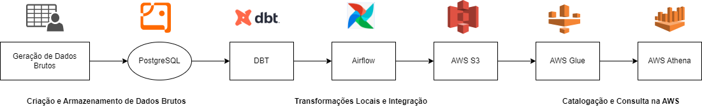

# ETL com DBT, Airflow, AWS S3, e AWS Glue



## Visão Geral do Projeto

Este projeto demonstra um pipeline ETL utilizando DBT (Data Build Tool), Airflow, e serviços da AWS como S3, Glue e Athena. O objetivo é extrair dados de uma base PostgreSQL, processá-los com DBT, armazená-los no S3 no formato Parquet e criar um catálogo dos dados no AWS Glue para posterior consulta no Athena.

### Arquitetura

* PostgreSQL: Base de dados onde os dados brutos estão armazenados.

* DBT: Ferramenta para transformar os dados brutos em dados refinados.

* Airflow: Orquestração do pipeline ETL.

* AWS S3: Armazenamento dos dados transformados no formato Parquet.

* AWS Glue: Criação de um catálogo para os dados armazenados no S3.

* AWS Athena: Consulta aos dados catalogados no Glue.

### Estrutura do Projeto

* Airflow DAGs: Configuração e execução do pipeline ETL.

* DBT Models: Transformação dos dados brutos em refinados.

* S3 Bucket: Armazena os dados no formato Parquet.

* Glue Crawler: Cria o catálogo dos dados armazenados no S3.

### Estrutura do Repositório

```
etl-dbt-airflow-aws/
│
├── dags/                              # Diretório das DAGs
│   ├── dbt_pipeline_dag.py            # Primeira DAG: Transformações locais com DBT
│   ├── dbt_aws_etl_pipeline.py        # Segunda DAG: Integração DBT e AWS
│
├── data/                              # Dados de entrada ou arquivos CSV gerados
│   └── bank_transactions.csv
│
├── dbt/                               # Projeto DBT
│   ├── models/
│   │   ├── etl_project/
│   │   │   ├── transactions_summary.sql
│   │   │   ├── exemplo_modelo.sql
│   │   └── sources.yml
│   ├── dbt_project.yml
│   ├── profiles.yml
│
├── scripts/                           # Scripts auxiliares
│   └── generate_bank_transactions.py  # Script para gerar dados fictícios
│
├── docker-compose.yml                 # Arquivo para orquestração dos containers
├── Dockefile                # Cria uma imagem Docker                            
├── requirements.txt                   # Dependências do Airflow e outros
├── README.md                          # Documentação do projeto
```
## Configuração do Ambiente Inicial ##

>Criação do Docker Compose - Serviços

* ``` airflow-webserver ``` e ``` airflow-scheduler ``` Para o Airflow
* ``` postgres ``` Para o Banco de dados local
* ``` docker-compose.yml ```
* ``` Dockerfile ```
* ``` requirements.txt ```

## DAGS

>1ª DAG: ```dbt_pipeline_dag.py```

Essa DAG foi criada para orquestrar o processo de transformação de dados utilizando o DBT e realizar refinamentos na tabela bank_transactions no PostgreSQL.

**Objetivo**

* Gerar dados fictícios e carregá-los no PostgreSQL
* Execução do DBT: Realiza transformações no banco de dados PostgreSQL utilizando modelos DBT.
* Finalização do Pipeline: Marcador de conclusão.

>2ª DAG: ```dbt_aws_etl_pipeline.py```

Essa DAG foi criada para integrar o Airflow com a AWS. Ela refina os dados com DBT, carrega os resultados no S3 e atualiza o catálogo no Glue.

**Descrição**

A DAG executa as seguintes etapas:

* Início do Pipeline: Marcador inicial.
* Execução do DBT: Refina os dados na tabela bank_transactions.
* Carregamento no S3: Envia os dados transformados para um bucket no AWS S3.
* Execução do Glue: Atualiza o catálogo no Glue para que os dados estejam disponíveis no Athena.
* Finalização do Pipeline: Marcador de conclusão.

**Diferenciais e Integração**

>Primeira DAG ```dbt_pipeline_dag.py```

* Focada no refinamento local de dados.
* Usa PostgreSQL como destino final das transformações.

>Segunda DAG ```dbt_aws_etl_pipeline.py```

* Integra o ambiente local com a AWS.
* Permite consultas no Athena e armazenamento a longo prazo no S3.

## Etapa 3: Configuração do PostgreSQL ##

* Conexão ao PostgreSQL no Container

```bash

docker exec -it etl-dbt-airflow-aws-postgres-1 bash

```

* Conectar ao banco

```bash

psql -U airflow -d airflow

```

* Criação de Tabelas e População com Dados

>Usamos um script Python ```scripts/generate_bank_transactions.py``` para criar um CSV fictício.

```
>Acessamos o PostgreSQL no container

```bash

docker exec -it etl-dbt-airflow-aws-postgres-1 bash
psql -U airflow -d airflow

```

>Criamos a tabela ```bank_transactions``` para armazenar os dados brutos

```sql
CREATE TABLE public.bank_transactions (
    transaction_id SERIAL PRIMARY KEY,
    account_id INT NOT NULL,
    transaction_date TIMESTAMP NOT NULL,
    amount NUMERIC(10, 2) NOT NULL,
    transaction_type VARCHAR(50) NOT NULL,
    category VARCHAR(50) NOT NULL,
    description TEXT
);
```
### Resumo do Processo ###

>Geração dos Dados

* A função ```generate_fake_data_to_db``` é chamada pela DAG 1.
* Os dados são gerados usando Faker e random.

>Conexão ao Banco de Dados

* A conexão é realizada diretamente dentro do script utilizando ```psycopg2```.

>Criação e Inserção

* A tabela bank_transactions é criada caso ainda não exista.
* Os registros são inseridos diretamente no PostgreSQL.

>Execução Automatizada pela DAG:

* A tarefa ```generate_fake_data_to_db``` executa esse processo como parte do fluxo da DAG.

## Etapa 4: Configuração do DBT ##

* Criar o ``` dbt_project.yml ```
* Criar o ``` profiles.yml ```
* Criar modelos ```models/etl_project/``` para transformar dados brutos em refinados
    * ```transactions_summary.sql```
    * ```exemplo_modelo.sql```

## Etapa 5: Configuração do ETL

Criamos a DAG dbt_aws_etl_pipeline no Airflow para orquestrar as tarefas do pipeline ETL.

**Fluxo da DAG**

* Executa os modelos do DBT para transformar os dados.

* Exporta os dados refinados do PostgreSQL para o S3 no formato Parquet.

* Executa o AWS Glue Crawler para catalogar os dados no Glue.

## Etapa 6: Configuração do AWS S3

Criamos o bucket etl-dbt-athena-data para armazenar os arquivos Parquet.

## Etapa 7: Configuração do AWS Glue

* Criamos o Glue Crawler ```etl_dbt_crawler``` para catalogar os dados do bucket S3 no Glue Data Catalog.

* Associamos a IAM Role ```AWSGlueServiceRole-etl-dbt-athena-data``` com permissões para acessar o bucket S3 e executar o crawler.

## Etapa 8: Configuração do IAM

* Atualizamos as permissões da IAM Role associada ao Glue Crawler para incluir a ação s3:GetObject no bucket etl-dbt-athena-data.

## Contribuição

Contribuições são bem-vindas! Sinta-se à vontade para abrir issues e pull requests.

## Responsável Técnico

Projeto mantido por **Cézar Augusto Meira Carmo.** 

Para mais informações: **dataengineercezar@egmail.com**
